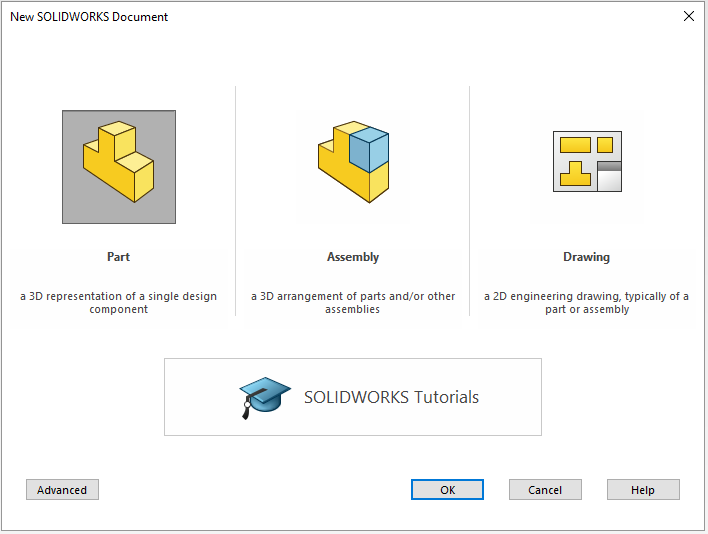
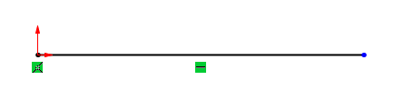

# Introduction to Sketching

## Stages in the sketch process

Every sketch has several characteristics that contribute to its shape, size and orientation. You will always follow the same workflow when creating any part:

1. Create part.
2. Sketch geometry.
3. Add relations.
4. Extrude sketch.
5. Repeat...

## Create a part

When you first open up SolidWorks, a window will appear prompting you to create a new SolidWorks document. This can either be a part, assembly or drawing. If this window does not appear, you can create a new part by selecting: **File, New** from the main menu.

> Always remember to save your part files frequently. Try and save it as soon as you have created a new document.

## What is sketching in SolidWorks?
Sketching is the act of creating a 2D profile comprised of a wireframe geometry. Typical geometry include:

- Lines
- Arcs
- Circles
- Ellipses

## Creating a sketch
To create a sketch, you must choose a plane on which to sketch. The system provides three initial planes by default. They are:

- Front plane
- Top plane
- Right plane

> It is important to choose the correct plane to start your sketch on as this choice can influence how your drawing of the part is going to be layed out.

When creating a new sketch, **Insert Sketch** opens up the sketcher on the selected plane. If you have not selected a plane when you insert a sketch, SolidWorks will ask you to select the plane on which you want to sketch on.

### Active sketch environment
When you have selected a plane to sketch on, the selected plane will rotate so it is parallel to the screen. **This only happens for the first sketch of the part.** You will see two red arrows originating from the same point, one pointing upwards and the other points right. It represents the **sketch origin**.

### Confirmation corner
When any SolidWorks commands are active, a symbol or a set of symbols appears in the upper right corner of the graphics area. This is called the **confirmation corner.** When a sketch is opened, the confirmation corner displays two symbols. One looks like the sketch symbol and the other is a red X. These symbols provide a visual reminder that you are active in a sketch.
> Clicking the sketch symbol exists the sketch and *save any changes*. 

> Clicking the red X exits the sketch and discards any changes.

When other commands are active, the confirmation corner displays a green check mark and a red X. The check mark executes the current command and the X cancels the command.

### Sketch entities
SolidWorks offers a vaiety of sketch tools for creating profile geometry. The **line** tool will be used most of the time. Other sketch entities include:

- Circle
- Arcs
- Ellipse
- Partial ellipse
- Parabola
- Spline
- Arc slots
- Polygon
- Rectangle
- Point
- Centerline

### Basic sketching
There are two techniques to sketch a geometry:

**Click-Click**
Position the cursor where you want the line to start. Click the left mouse button. Move the cursor to where you want the ine to end. A preview of the sketch entity will follow the cursor. Cick the left mouse bitton a second  time. 

**Click-Drag**
Position the cursor where you want the line to start. Press and hold the left mouse button. Drag the cursor to where you want the sketch entity to end. A preview of the sketch entity will follow the the cursor. Release the left mouse button.

## Sketching a line
Sketch a line by selecting the line tool. Click on the origin and move your mouse horizontally to the right. A preview of the line will appear. Click again to end the line.

Do not be too concerned with making the line the exact length you want it to be at the start when you create the sketch. Your sketch only need to be the approximate size of your final sketch. The dimensioning tool will be used later to make the size exact.

Next, starting at the end of the horizontal line, sketch a line at an angle.

### Inference lines
Dashed inference lines appear when drawing lines to help you 'line-up' with existing geometry. These lines include existing line vecotrs, normals, horizontals, veritcals, tangents and centers.

Note that some lines capture actual geometric relations, while other simply act as a guide or reference when sketching. 

A difference in the color of the inference lines will distinguish them. 

In the picture below, the line labeled "A" are olive-green and if the sketch line snaps to them, will capture either a tangent or perpendicuar relationship. 

The line labeled "B" is blue. It only provides a reference, in this case verical, to the other endpoint. If the sketch line is ended at this point, no vertical relation will be captured.

### Sketch feedback
The sketcher has many feedback features. The cursor will change to show what tipes of entity is being created. It will also indicate what selections on the existing geometry, such as end, coincident or midpoint, are available using a red dot when the cursor is on it.

The most three common feedback symbols are:

- **Endpoints:** Yellow concentric circles appear at the Endpoint when the cursor is over it.

- **Midpoint:** The midpoint appears as a square. It changes to red when the cursor is over the line.

- **Coincident:** The quadrant points of the circle appear with a concentric circle over the centerpoint.

### Closing the sketch
Close the sketch with a final line connected to the starting point of the first line.

> When you want to turn off a sketching tool, you can either press the Esc key, click the line tool a second time, or right-click and the graphics area and choose Select.

## Status of the sketch

Sketches can be in one of five definition states at any time. The status of a sketch depends on geometric relations between geometry and the dimensions that define it. The three most common states are:

- **Under defined:** There is inadequate definition of the sketch, but the sketch can still be used to create features. This is acceptable as most of the time during the initial stages of design, there is not enough information to fully define the sketch. Under defined geometry is **blue**.
- **Fully defined:** The sketch has complete information. Fully defined geometry is **black**. A general rule is that when a part is released for manufacturing, the sketches within it should be fully defined.
- **Over defined:** The sketch has duplicate dimensions or conflicting relations and it should not be used until repaired. Extra dimensions and relations should be deleted. Over defined geometry is **red**.

## Check under defined sketch geometry

### Check sketch status

A sketch is **Under defined** because some of the geometry is blue. Note that endpoints of a line can be a different color and different state than the line itself. 

For example, a vertical line from the origin is black because it is:

- Vertical
- Attached to the origin

However, the uppermost endpoint is blue because the length of the line is under defined.

### Dragging
Under defined geometry can be dragged to new locations or its size changed. Fully defined geometry cannot. You can determine how the geometry is under defined by dragging the blue parts of the geometry. The lines will either move or increase/decrease in length. This will give you an indication that you need to define the length of the line or need to define the location of the line.

## Design intent
The design intent governs how the part is built and how it will change. In a sketch, design intent is controlled by a combination of two things:

- **Sketch relations:** Create geometric relationships such as parallel, collinear, perpendicular, or coincident between sketch elements.
- **Dimensions:** Dimensions are used to define the size and location of the sketch geometry. Linear, radial, diameter and angular dimensions can be added.

To fully define a sketch *and* capture the desired design intent requires understanding and applying a combination of relations and dimensions.

### Sketch relations
Sketch relations are used to force a behaviour on a sketch element thereby capturing design intent. Some relations are added automatically when you create the initial sketch and others can be added later manually.

You can check the existing relations by either:

- Symbols appear next to the geometry to indicate what relations are associate with that entity. In the picture below, the arc has three relations: two tangent and one equal.
- Select the skech entity and the Property Manager show the relations associated with that entity.

> You can delete a relation by either clicking the relation icon and pressing the **Delete** button. You can also right click on the relation icon and selecting the delete option.

### Examples of sketch relations
There are many different sketch relations. Which ones are valid depends on the combination of geometry that you select.
The following are sketch relations:

- Coincident
- Merge
- Parallel
- Perpendicular
- Collinear
- Horizontal
- Vertical
- Equal
- Midpoint

## Smart dimensions
The *Smart Dimension* tool determines the proper type of dimensions based on the geometry chosen. For example, if you pick an arc the system will create a radial dimension. If you pick a circle, you will get a diameter dimension, while selecting two parallel lines will create a linear dimension between them. In cases where the *Smart Dimension* tool is not quite smart enough, you have the option of selecting endpoints and moving the dimensions to different measurement positions.

### Where to find it
The *Smart Dimension* tool can be selected either by:

- Selecting *Smart Dimension* tool from the *Tools* option
- Right-click on the canvas and select *Smart Dimension* from the shortcut menu
- On the Dimensions/Relations toolbar, pick *Smart Dimension* tool

### Creating and previewing a dimension
As you select a line in the sketch geometry with the dimension tool, the system creates a preview of the dimension. The preview enables you to ensure that you have captured the correct dimension as well as enable you to see all the different options there are.

> Clicking the right mouse button after you have selected the geometry with the dimension tool, locks the orientation of the dimension preview.

You can place the dimension anywhere on the canvas by clicking the left mouse button. Once you have placed the dimension, a *Modify* tool will appear, displaying the current value of the line you selected. You can enter a new value for the line in the box provided. There is a thumbwheel that will also incrementally increase/decrease the value in the *Modify* toolbox.

>You can change the value of the dimension later as well, by just double-clicking on the dimension which will result in the *Modify* tool window appearing.

### Angular dimensions
Angular dimensions can be created using the same dimension tool used for linear, radial and diameter dimensions. Select either two lines that are both non-collinear and non-parallel, or select three non-collinear endpoints.
Depending on where you place the angular dimension, you can get the interior or exterior angle, the acute angle, or the oblique angle.

## Extrude the geometry
Once the sketch is completed, it can be extruded to create the first feature of the part. There are many options for extruding a sketch including the start and end conditions, draft and depth of extrusion, which will be discussed in more detail in later lessons.
Typically, extrusions take place in the direction normal to the sketch plane.

### How to select the extrude feature
- From the menu: **Insert, Boss/Base, Extrude...**
- On the Features toolbar, choose **Boss/Base**

### Extrusion options
As soon as you select the Extrude feature, the view of the geometry will change to trimetric and a preview of the extrusion will show with the default depth.
Handles (purple arrows) appear that can be used to drag the preview to the desired depth. The handles are colored for the active direction and gray for inactive direction. A **Ruler** will appear when you use the handle to edit the depth of the extrusion.

Different extrusion settings are available for you to choose from to determine the depth of your extrusion. 

Once the feature is completed, the sketch will be absorbed into the **Extrude1** feature.

## Sketch guidelines
Here are a few *rules of thumb* for sketching in SolidWorks:

- Keep your sketch simple. Simple sketches are easier to edit, and are less likely to develop errors.
- Make use of the origin in your first sketch.
- Create sketch geometry first, add geometric relationships second, and then add your dimensions last. Dimensions can sometimes interfere with the addition of required relations.
- Use geometric relations wherever possible to maintain design intent.
- Add or edit dimensions on the closest/smallest geometry first, then work our way to the outer/larger geometry to prevent geometry overlap.
- Use relations, linked values and equations to reduce the number of independent dimensions needed.
 Take advantage of symmetry. Use **Mirror** or **Dynamic Mirror** sketch tool to mirror sketch elements and add symmetrical relations.
- Be flexible. It may be necessary to change the order in which you are adding dimensions or relations.
- Fix errors as they occur.
